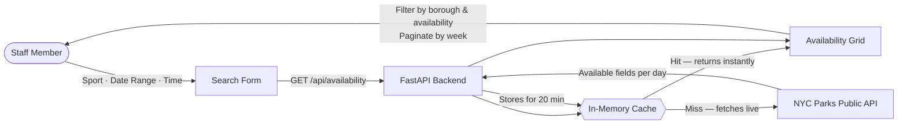

# Automated Industries - NYC Parks Field Availability  🌳

A tool for searching athletic field availability across NYC Parks — by sport and date range — in a single calendar view. Built as a replacement for the city's map-based permit site, which requires clicking field by field, day by day.

---

## Setup & Running

**Prerequisites:** Python 3.10+, Node 18+

```bash
./start.sh
```

That's it. The script creates the Python venv, installs all dependencies, and starts both servers:

- Frontend: http://localhost:5173
- Backend API: http://localhost:8000

---

## Architecture

```
frontend/   React 19 + Vite + Tailwind CSS v4
backend/    FastAPI + httpx + Python 3
```



The app is split into clear layers, each with a single responsibility:

| File | Role |
|---|---|
| `frontend/src/App.jsx` | State management, fetch logic, and component wiring |
| `frontend/src/components/SearchForm.jsx` | Search controls — sport, date range, time slot |
| `frontend/src/components/AvailabilityCalendar.jsx` | Availability grid, borough & availability filters, week pagination |
| `backend/main.py` | Proxy to NYC Parks API, sport filtering, in-memory cache |
| `api/index.py` | Vercel serverless entry point — imports and exposes the FastAPI app |

The backend exists as a proxy rather than calling NYC Parks directly from the browser for two reasons: NYC Parks blocks requests that don't include browser-style headers, and keeping rate limiting and caching server-side is safer and more controllable than exposing it to the client.

On each `/api/availability` request the backend loops day-by-day over the requested range, hits `nycgovparks.org/api/athletic-fields?datetime=DATE+TIME`, filters by sport keyword, and returns a unified response with a field list and a day-by-day availability map.

The frontend renders this as a scrollable grid — fields as rows, dates as columns, green/red cells for available/unavailable — with borough and availability filters and week-by-week pagination.

**Time slots:** The user selects a specific time (8:00 AM – 11:30 PM, 30-minute increments). Availability reflects which fields are not reserved at that exact time on each day.

**Caching:** Results are cached in memory per `(sport, date, time)` tuple with a 20-minute TTL. Overlapping date range requests at the same time reuse cached days. The cache resets on server restart.

**Rate limiting:** Requests are made sequentially (one per day in range), capped at 14 days per query. Browser-style headers are sent to avoid being blocked by the NYC Parks server.

---

## Deploying to Vercel

The frontend deploys as static files and the backend as a Python serverless function, both on the same Vercel project.

```bash
npm i -g vercel
vercel
```

Set one environment variable in the Vercel dashboard (Settings → Environment Variables):

| Variable | Value |
|---|---|
| `VITE_API_BASE` | *(leave empty)* |

On deploy, the frontend bundle will use relative URLs (`/api/...`) that resolve to the same Vercel domain as the Python function.

---

## AI Usage

This project was built with AI assistance from Claude Code throughout. Key areas:

- **Rapid comprehension.** Used AI to break down the case study quickly, identify the core problem, and map it to a concrete technical approach before writing any code.
- **Full-stack scaffolding.** AI assisted with implementing the FastAPI backend, React frontend, Vercel deployment config, and the start.sh setup script.
- **Directed decision-making.** Product and architecture decisions were mine: I drove what to build (time slot selection, borough filter, week-by-week pagination) and asked for thorough breakdowns before approving any implementation.
- **Developer-to-developer reasoning.** Used AI as a sounding board: asking why before asking for code, questioning tradeoffs, and pushing back when explanations weren't clear enough.
- **Research and discovery.** Used AI to investigate the NYC Parks API structure, confirm the borough prefix convention, and surface the Socrata Athletic Facilities dataset as a path to a complete field catalog.

Where I chose not to rely on AI: the AI usage section of this README, the walkthrough framing, and any judgment call about what the client actually needs on Monday morning — those stayed mine.

---

## If this went to production

- **Persistent cache.** Swap the in-memory dict for Redis. Serverless instances don't share memory, so the current cache only helps within a single warm instance.
- **Concurrent fetches.** Replace the day-by-day loop with parallel requests so all days are fetched at once. Drops 14-day cold latency from ~15s to ~2s.
- **Upstream monitoring.** The NYC Parks API is undocumented and unofficial. Add an alert that fires if the response shape changes or error rates spike — this scraper will break silently if the city updates their site.
- **CORS lockdown.** Replace `allow_origins=["*"]` with the specific Vercel deployment domain.
- **Auth.** Add a simple token or HTTP Basic layer before sharing with the client team. The tool currently has no access controls.
- **Polite parallel fetching.** If switching to concurrent requests, add a small delay between them so the NYC Parks server isn't hit with a burst — a basic courtesy for scraping a public site.
- **Complete field catalog.** The NYC Open Data platform publishes an official Athletic Facilities dataset ([qnem-b8re](https://dev.socrata.com/foundry/data.cityofnewyork.us/qnem-b8re)) with all ~6,900 facilities including borough, sport, and geometry. Cross-referencing this with the live availability API would allow fully booked fields to be shown (currently invisible since the availability endpoint only returns fields that are free).

---

## Known Limitations

- **Not all sports are filterable.** Rugby, Lacrosse, Netball, Bocce, Kickball, Frisbee, T-Ball, and Track & Field don't appear as keywords in the availability API's field ID strings. They're excluded from the sport filter.

- **Slow on wide date ranges.** A 14-day search makes ~14 sequential HTTP requests (~10–15 seconds cold, near-instant on repeat due to caching).

- **Cache is in-process.** Restarting the backend clears all cached results. A production deployment would use Redis or a database.

- **CORS is open.** The backend allows all origins (`*`). Fine for local use; should be locked to the frontend's domain before deploying publicly.

- **No authentication.** The tool is open to anyone who can reach it. Production would need access controls for a client deployment.
